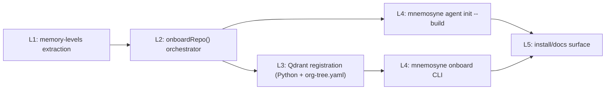

# Horizontal Plan — mnemosyne-repo-onboarding

Maps every architectural layer this epic touches and the cross-layer
dependencies between them. Layers listed in dependency order (lower layers
have no upward dependency on this epic's own new code).

## Layer 1 — Introspection extraction (TypeScript, `lib/mnemosyne/server.ts`)

Extract `GET /memory-levels`'s per-level `configured` computation
(`existsSync` for levels 0/1, `client.getConfiguredLayers()` presence for
levels 2-4) out of the route handler into a standalone, client-
parameterized function. Zero behavior change for the existing route — the
route becomes a thin caller of the extracted function. This is the one
piece every other layer below reads from (grill finding 3.1).

**Depends on:** nothing new — reads `MEMORY_LEVELS` (`memory-levels/
levels.ts`, shipped) and `MnemosyneClient.getConfiguredLayers()` (shipped).

## Layer 2 — Shared onboarding orchestrator (TypeScript, `lib/mnemosyne/onboarding/`)

New module composing already-shipped primitives into one sequence:
`syncAllHarnesses` (`layer1/sync.ts`), `writeRepoLocalPersona`
(`layer1/persona-store-repo-local.ts`), `writeFileStoreIndex`
(`layers/FileStoreIndex.ts`), graphify build (gated by `isCommandOnPath`,
`layers/GraphifyLayerAdapter.ts`), and Layer 1's extracted base-level
report (from Layer 1 above, via a freshly-constructed, repo-scoped
`MnemosyneClient`). Mode-parameterized (`'tree' | 'standalone'`) — Mode A
additionally invokes Layer 3 below; Mode B does not.

**Depends on:** Layer 1 (base-level report function).

## Layer 3 — Qdrant-tree registration (Python, `mnemosyne/`, + new org-tree registry)

Two new pieces:
- `mnemosyne/onboarding.py` — `create_collection_and_scope(name, scope)`,
  additive-only, sibling to the existing `placement_engine.py` (reused,
  unmodified) and `inventory/qdrant_inventory.py` (reused, unmodified).
- `~/.mnemosyne/org-tree.yaml` — a new, canonical, operator-global registry
  of onboarded repos (path, collection, scope, org-tree path,
  needs_override, onboarded_at), mirroring the existing `~/.mnemosyne/
  level0-rules.md` convention for "operator-global, not per-repo" state.
  Read/write helpers live in TypeScript (`lib/mnemosyne/onboarding/
  orgTree.ts`) since the CLI verb calling it (Layer 4) is TypeScript;
  classification itself still goes through the Python `placement_engine`
  via subprocess.

**Depends on:** `placement_engine.py` (shipped, reused as-is),
`qdrant_inventory.py`'s `HttpQdrantClient` pattern (shipped, extended only
if the swarm-memory-native path doesn't exist — see grill finding 2.1).

## Layer 4 — CLI surface (`bin/mnemosyne`, `bin/mnemosyne-agent.mjs`)

- `mnemosyne onboard <path> --collection <name> [--override ...] [--create]`
  — new dispatch branch in `bin/mnemosyne`, matching the existing
  `reindex`/`persona`/`agent` shape exactly.
- `mnemosyne agent init --build` — new opt-in flag on the existing `agent
  init` verb in `bin/mnemosyne-agent.mjs`.

**Depends on:** Layer 2 (orchestrator) for both; Layer 3 (registration)
for `onboard` only.

## Layer 5 — Install/docs surface (`docs/install.sh`, `README.md`, `docs/embedded-layers.json`)

Printed next-steps text updates (mirroring `install.sh`'s existing
"prints, never runs `agent init`" convention, extended one level to "prints,
never runs `agent init --build`"), a new recommended
`mnemosyne.layers.json` template for embedded/Mode B installs that omits
`vector`.

**Depends on:** Layer 4 (the flag/verb text it documents must exist first).

## Cross-layer dependency graph

## Cross-cutting note

Every layer above is additive to already-shipped code except Layer 1
(a pure extraction/refactor of one existing route handler, regression-
tested to be byte-identical for `GET /memory-levels`'s existing behavior).
No existing consumer-visible contract changes shape.
