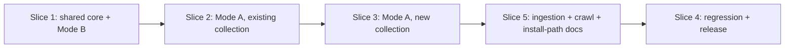

# Vertical Plan — mnemosyne-repo-onboarding

Minimum cross-stack increments; each slice leaves the product in a
genuinely working state. Slices execute sequentially — each depends on the
prior slice's stories.

## Slice 1 — Shared core + Mode B (standalone/embedded), zero external infra

**Working state at the end of this slice:** a product embedding Mnemosyne
can run `mnemosyne agent init --build` and immediately have a working,
self-contained recall()/remember() loop over its own codebase — the
literal Mode B ask, fully deliverable with no Qdrant/swarm-memory
dependency at all.

- `ro-01-memory-levels-scoped-extraction` — extract the base-level
  computation so it can be called against an arbitrary repo, not just the
  running service's own singleton.
- `ro-02-onboard-repo-core-orchestrator` — the shared sequence (Layer 1
  sync, persona seed, L4/L2 index, base-level report) both modes use.
- `ro-03-agent-init-build-flag` — Mode B's real entry point.
- `ro-08-role-metadata-reachability-verification` — proves the "roles and
  metadata become EASY to define" payoff is real and reachable, not just
  assumed as a side effect of `ro-02`.

**Why first:** lowest blast radius (no live Qdrant Cloud writes anywhere in
this slice), delivers one of the two operator asks completely on its own,
and every later slice's shared orchestrator work is already paid for here.

## Slice 2 — Mode A onboarding of an already-existing collection

**Working state at the end of this slice:** the operator can run
`mnemosyne onboard <path> --collection <existing-name>` against a repo
whose Qdrant collection already exists (created by hand or by prior
`swarm-memory` usage) and get real classification, org-tree registration,
Layer 1 sync, persona seed, and a full first-time index across every
applicable level — everything Mode A needs except creating a brand-new
collection from nothing.

- `ro-04-org-tree-registry` — the canonical `~/.mnemosyne/org-tree.yaml`
  registry + read/write helpers.
- `ro-05-onboard-cli-verb-existing-collection` — the CLI verb, wired to
  `placement_engine.py` (subprocess) + `ro-02`'s orchestrator + `ro-04`'s
  registry.

**Why second:** proves the full Mode A pipeline end-to-end against
existing, safe infra before the highest-risk piece (live collection
creation) is introduced.

## Slice 3 — Mode A: genuinely new repo, collection created from nothing

**Working state at the end of this slice:** the operator's literal ask —
"a way to add a new repo or spot... to the memory" for a repo that has
**never** touched Qdrant before — is fully real. `mnemosyne onboard <path>
--collection <name> --create` creates the collection, registers the
scope mapping, classifies and places it, and runs the full onboarding
sequence.

- `ro-06-collection-creation-and-scope-mapping` — the new, additive-only
  Python collection-create + scope-mapping primitive (includes the
  research spike on the real `swarm-memory` CLI surface, per grill
  finding 2.1).
- `ro-07-onboard-new-collection-full-mode-a` — wires `--create` through
  `ro-05`'s CLI verb into `ro-06`'s new primitive.

**Why third:** deliberately last — the one genuinely new, live-infra-
mutating piece, sequenced after both the shared core and the safer
existing-collection path are already proven.

## Slice 4 — Regression, release

**Working state at the end of this slice:** full-suite regression clean,
version bumped, CHANGELOG entry present, README/install docs reflect the
new verbs, both modes independently smoke-tested end-to-end.

- `ro-09-full-regression-release`. **Amended:** now also depends on Slice
  5 below — see that slice's own "why last" note.

## Slice 5 — Amendment: document ingestion, website crawl, two install paths (2026-08-19)

**Working state at the end of this slice:** a repo/product onboarded by
Slice 1-3 can also have arbitrary text/Markdown content (uploaded files,
CV, free-text description) and a bounded, single-page-default website
crawl fed into its SAME memory via the SAME `remember()` floor — and both
the operator's own README/install docs and `agent status`'s own output
make the sidecar-vs-full-system install choice explicit and discoverable.

- `ro-10-document-ingestion-primitive` — `ingestDocument()`, reusing
  `remember()`'s existing multi-layer cascade unchanged.
- `ro-11-bounded-website-crawl` — reuses `ro-10`'s primitive as its landing
  mechanism; deliberately isolated, held to `ro-06`'s own safety rigor.
- `ro-12-two-explicit-install-paths` — pure docs/CLI-output discoverability,
  no new mechanism.

Also two small, in-place amendments to already-planned Slice 1 stories
(`ro-02`'s vector-`notesDirectory` colocation, `ro-03`'s `--storage-dir`
flag + hooks-reminder line) — not their own slice, since they ship as part
of whichever slice `ro-02`/`ro-03` themselves land in.

**Why last:** every amendment story either reuses Slice 1's shared
orchestrator/`remember()` floor directly (`ro-10`) or reuses `ro-10` itself
(`ro-11`), or documents already-shipped Mode A/Mode B surface from every
prior slice (`ro-12`) — there is no working-state reason to sequence any
of this before Slices 1-3 land. `ro-09` (Slice 4, regression/release) now
depends on this slice too, so release only happens once the full,
amended scope is regression-clean.

## Slice dependency graph (amended)

## Deferred (explicitly, not silently dropped)

- `ingest-a10ab2c1`'s remaining `repo-*` bulk-sweep stories — re-scoping
  recommendation surfaced in the design discussion; not this epic's stories
  to rewrite (open question #1).
- `m-06-continuous-indexing` (background scheduling), `m-07-first-god-
  integration` (Minerva-specific validation), `m-08-bulk-reindex-command`
  (idempotent/resumable multi-repo state tracking) — all remain
  `mnemosyne-foundation`'s own backlog, referenced but not re-planned here.
