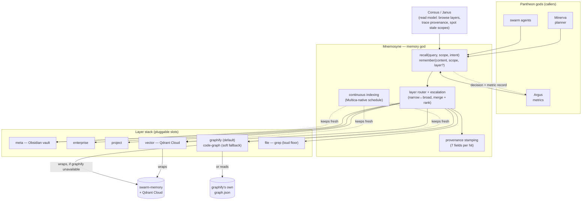

# Mnemosyne

[](https://github.com/mdostal/mnemosyne/actions/workflows/ci.yml)
[](./LICENSE)
[](https://github.com/mdostal/pantheon-v2)
[](https://mdostal.github.io/mnemosyne/)

**The Pantheon's Memory god** — one unified layer that *writes and recalls* across every memory scope the swarm has, so **"memory over find"** becomes the default retrieval path for every agent instead of `grep`/`find`.

Named for the Greek titaness of memory. Site + diagrams: **[mdostal.github.io/mnemosyne](https://mdostal.github.io/mnemosyne/)**.

## What & why

The swarm already runs real memory infrastructure — remote **Qdrant Cloud** vector memory (via [`swarm-memory`](https://github.com/mdostal/swarm-memory)), a code/docs impact graph, and the hive's **Obsidian** knowledge vault (Consus's knowledge home). The problem is that these are **separate, manually wired, and un-unified**: no single service owns the layer stack, no one `recall`/`remember` API spans them, and so agents fall back to `find`/`grep` because the memory path isn't the obvious one.

Mnemosyne exists as its own god so that **one service owns the memory contract** for the whole Pantheon. It **unifies infrastructure we already run** behind a single, escalating, provenance-tracked API — it does **not** reinvent the vector DB, the embedder, or the vault. Every other god calls Mnemosyne to remember and recall; Mnemosyne routes writes to the right layer and walks the stack on reads.

## The layer stack

Memory is organized as an ordered, escalating stack — meta (broad) to file (raw). A recall walks the layers and merges/ranks hits **with provenance**; a write routes to the correct layer(s) and keeps indexes coherent.

```
meta        (hive Obsidian vault — Consus knowledge home / canonical truth)
  → enterprise   (org-wide knowledge + standards, promoted from approved CBAs)
    → project    (per-project working memory, decisions, context)
      → graphify     (typed impact graph: depends_on / cites / implements — default; see below)
        → vector     (Qdrant Cloud — default backend, semantic recall)
          → file     (raw grep — loud-failure floor)
```

Backends are **pluggable**: Qdrant is the *default* vector backend but the slot is swappable (any OpenAI-compatible embeddings / alternate vector store); Obsidian is the default meta store but the meta layer is a contract, not a hard dependency. Slot config is owned by **Vesta**.

**Graph layer: [Graphify](https://github.com/Graphify-Labs/graphify) by
default, `code-graph` as a soft, automatic fallback.** A real A/B benchmark
against this repo found the older in-house `code-graph` layer's backing
store had **zero** nodes from this repo (it has no per-repo scoping), while
Graphify indexed 1470+ real nodes from this repo's own source, faster —
see `docs/layer-architecture-v2-plan.md` §7. `uv tool install graphifyy` is
**recommended, not required**: an unconfigured install with no `graphify`
binary on PATH automatically falls back to `code-graph` (with a logged
warning, never a hard failure), so a bare `npm install` still works. Both
layers stay registered and explicitly selectable via `MNEMOSYNE_LAYERS` —
this only changes the *unconfigured* default, never how configuration
itself works (see `SERVICE.md`'s "Graph" section for the full gating
rules).

## Architecture



Mnemosyne fills the **memory capability slot** in Pantheon: one god per capability, ABI-swappable, owns its own memory, runs standalone, standard interface. It is a **library/service** other gods call — it does not plan, orchestrate, or route work. Every recall/write logs a decision + metric record (to Argus/Metis) like every other god.

## How it fits

- **Host / framework:** [pantheon-v2](https://github.com/mdostal/pantheon-v2) — the core host that assembles gods behind shared contracts.
- **Substrate:** work is planned and executed on [Multica](https://github.com/firefly-events/multica) with the [plugin-hive](https://firefly-events.github.io/plugin-hive/) SDLC (kickoff → plan → execute → review → test → ship). Continuous indexing schedules are **Multica-native** (no localized cron).
- **Sibling gods it talks to:** **Minerva** (planner) and swarm agents are the primary recall callers; **Consus** / **Janus** provide the human read model (browse layers, trace a recall's provenance, spot stale scopes); **Vesta** owns which backend fills each layer slot; **Argus** / **Metis** receive the decision + metric records.
- **Builds on:** [`swarm-memory`](https://github.com/mdostal/swarm-memory) (Qdrant-backed semantic memory + code/docs impact graph) — adopted/wrapped as the vector layer, and (as a soft fallback) the `code-graph` layer, **not** rewritten. [`Graphify`](https://github.com/Graphify-Labs/graphify) is the default graph layer (see "The layer stack" above).

## Quickstart

```bash
curl -fsSL https://mdostal.github.io/mnemosyne/install.sh | bash
```

Clones this repo, `npm install`s it, and links `bin/mnemosyne` onto your
`PATH`. Prints (does not run) `mnemosyne agent init` as a separate next
step, which registers Mnemosyne as an MCP server with Claude Code / Codex
CLI and installs its usage skills — see `mnemosyne agent status` to preview
state first. Safe to re-run (updates the existing clone instead of
re-cloning).

**Choose your install path** — two deliberate, named choices (same
Mode A/Mode B vocabulary `design-discussion.md` already uses, never a
third, unmapped term):

- **Sidecar / embedded install (Mode B)** — package Mnemosyne as a
  product's own memory agent: `mnemosyne agent init --build [--storage-dir <dir>]`.
- **Full / system install (Mode A)** — register your own harness, then join
  your Pantheon tree (or your own standalone collection): `mnemosyne agent
  init` (no `--build`) + `mnemosyne onboard <path> --collection <name>
  [--create]`.

Manual / dev-clone alternative:

```bash
gh repo clone mdostal/mnemosyne
cd mnemosyne
npm install
npm test
```

Embedding Mnemosyne as a product's own memory agent (not a Mnemosyne
developer's own harness)? `mnemosyne agent init --build` runs a first-time
index of your codebase (Layer 1 sync, persona seed, file/graph index) as
part of the same step — opt-in, off by default, like `agent init` itself;
add `--storage-dir <dir>` to pin all of its memory state under a directory
your own install tooling controls. See `docs/embedded-layers.json` for a
recommended `mnemosyne.layers.json` for a bare embedded install with no
`swarm-memory` credential configured.

Optional but recommended: `uv tool install graphifyy` — installs the
`graphify` CLI that backs the graph layer by default (see "The layer stack"
above). Not required: without it, the service and library both fall back to
the `code-graph` layer automatically, with a logged warning, never a hard
failure.

See `npm run` in `package.json` for the service entrypoint, and [`hooks/README.md`](./hooks/README.md) to wire the pre-recall/post-remember hooks into an agent runner.

To **ingest a document into memory** — plain text/Markdown, or a free-text description/CV pasted with no file at all — bounded, chunked, and fed through the same `remember()` cascade above: `bin/mnemosyne ingest --file <path.txt|.md>` (or `--text "..."`) from the CLI, the `ingest_document` MCP tool, or `POST /ingest` against the MnemosyneClient HTTP API (`bin/mnemosyne-client-api`, default port 3141). The underlying `ingestDocument()` primitive (`lib/mnemosyne/ingest/ingestDocument.ts`) also accepts `.pdf` — extracted page-by-page via `unpdf`, with each chunk's provenance carrying both the source page and its chunk-within-page index, bounded by a separate `MAX_PDF_SOURCE_BYTES` pre-parse cap on the raw file's bytes — but **that PDF support is not yet reachable through any of the three external surfaces above** (`ro-13`, explicitly out of scope for that story's own `files_to_modify`): `bin/mnemosyne-ingest.mjs`'s `--file` reads its target as UTF-8 text, and `POST /ingest` (and therefore the `ingest_document` MCP tool, a thin wrapper over that same route) accepts only a JSON string `content` field — neither can carry a PDF's raw binary bytes end to end today. Wiring binary PDF upload through the CLI and HTTP route is real, disclosed follow-on work, not a silently-dropped feature. Oversized content or an unsupported format (anything outside `.txt`/`.md`/`.pdf` at the `ingestDocument()` level) is rejected loudly before any write.

To **crawl a website into memory**: `bin/mnemosyne crawl <url>` from the CLI, the `crawl_website` MCP tool, or `POST /crawl` against the same MnemosyneClient HTTP API — fetches EXACTLY the one given URL by default (never following any link; same-domain multi-page crawling is a separate, explicit `--max-pages`/`maxPages` opt-in, hard-capped regardless of what's requested), extracts best-effort text (naive tag-stripping, not a readability-grade engine — a known, named limitation), and feeds it through the same `ingestDocument()` primitive above — never a second storage path. `robots.txt` is always checked before any fetch; a disallowed path is never fetched. Not a general-purpose scraper and not a scheduled/background crawler — one bounded, on-demand call, plain unauthenticated GET only (401/403 fails loudly, never retried or worked around). A firm, default-on SSRF guard resolves the target hostname and rejects loopback/private-network/link-local/cloud-metadata addresses (including the `169.254.169.254` cloud-metadata address) before every individual fetch — there is no flag, option, or environment variable anywhere in `lib/mnemosyne/ingest/crawlAndIngest.ts` to bypass it.

The underlying vector memory Mnemosyne wraps is **already live** — it runs today through `swarm-memory` against remote Qdrant Cloud (credential at `~/.config/swarm-memory/qdrant.key`; **do not wipe** existing collections or the Obsidian vault — Mnemosyne is additive).

## Onboard a repo into the tree (Mode A)

`bin/mnemosyne onboard <path> --collection <name> [--scope-id <id>] [--override project|enterprise]`
brings a repo online against an **already-existing** Qdrant collection and
places it in the operator-global org tree (`~/.mnemosyne/org-tree.yaml`):
a real, read-only Qdrant check confirms `<name>` actually exists (fails
loudly, naming `--create`/ro-07, if it doesn't — collection *creation* isn't
supported by this verb yet), the collection is classified project- vs.
enterprise-scoped via `mnemosyne.placement_engine.classify_collection`, and
the same `onboardRepo()` pipeline `agent init --build` uses (Layer 1 sync,
persona seed, file/graph index, base-level report) runs against `<path>`.
An ambiguous/unmarked collection name still completes the run — flagged
`needs_override: true` in the org-tree entry and printed clearly — pass
`--override project|enterprise` to set the scope explicitly instead of
accepting the heuristic's own default.

## Status

**Phase 1 v1 is implemented.** The service wraps the existing `swarm-memory`
engine, and `hooks/` contains the runner-agnostic pre-recall/post-remember loop:
small per-repo + shared memory bundles before a ticket, status-aware write-back
after a run, and a cache-safe prompt layout that keeps the stable prefix
separate from the variable ticket memory delta.

## Desktop app (Tauri)

A Tauri v2 project skeleton lives under [`src-tauri/`](./src-tauri/) — a
packaged, long-running desktop app that wraps this service's own dashboard
(`src/server.mjs` + `ui/`) with a native tray/window and auto-update,
instead of a foreground terminal the operator must keep open.

`da-01`/`da-02` landed the project scaffold and a vendored-Node sidecar
(spawned with an explicit `PATH`/`SWARM_MEMORY_BIN`/`PORT` fix so it works
identically whether launched from a terminal or Finder/Dock/launchd).
`da-03` adds the tray/menu-bar shell itself: a native tray icon whose
left-click shows/focuses a single dashboard window pointed at exactly
`http://127.0.0.1:8477/ui` (never the bare `/` root, which content-negotiates
differently) — the app launches with **zero windows**, tray-only, and the
window is created lazily on first click, only after a bounded (never
unbounded, never a single immediate attempt) poll of the sidecar's own
`GET /healthz` confirms it's actually accepting connections. The tray's
right-click menu carries a real, visible, always-toggleable "Launch at
Login" item (`tauri-plugin-autostart`, a genuine `launchd` LaunchAgent under
`~/Library/LaunchAgents/` — never a bespoke login-item hack) plus Quit.

`da-04` wires the auto-updater mechanism (`tauri-plugin-updater`): a
locally-generated Ed25519/minisign signing keypair (public half committed
into `tauri.conf.json`'s `plugins.updater.pubkey`, private half living ONLY
at `~/.tauri/mnemosyne-desktop.key` on the operator's own machine, supplied
to a build via the `TAURI_SIGNING_PRIVATE_KEY` env var and never committed —
`src-tauri/tests/no_private_key_committed.rs` is a real, re-runnable proof
of that, not a policy statement), plus a GitHub-Releases-hosted update
manifest (`plugins.updater.endpoints`, resolving on this machine to
`https://github.com/mdostal/mnemosyne/releases/download/desktop-v<version>/darwin-aarch64.json`).

**The updater is OPT-IN, off by default.** The tray menu gains a second
checkbox, "Check for Updates," unchecked on a fresh install — the app makes
**zero** update-check network requests until the operator explicitly turns
it on (a real test proves this: `src-tauri/src/updater.rs`'s
`maybe_trigger_update_check_fires_zero_times_when_disabled`). The choice
persists across restarts via a marker file under the app's own
`app_data_dir` (mirroring `da-03`'s own autostart-default marker). Once
enabled: a check fires immediately (the moment it's toggled on) and again
once per subsequent app launch while it stays enabled; toggling it back off
stops all further checks — no periodic timer, no background polling.

**Two things `da-04` explicitly does NOT achieve** (named directly, never
left to silent omission): **(1) no notarization** — the shipped build
remains unsigned/unnotarized (real Gatekeeper enforcement still applies —
`da-05`'s own real findings below show this can be a silent App
Translocation rather than always a blocking dialog, depending on the exact
macOS version and quarantine state), and only a real, operator-owned Apple
Developer Program membership + Developer ID Application certificate (which
this agent cannot obtain) closes that gap; `da-05`'s own local "Open
Anyway" workaround is the real staged path that doesn't wait on it. **(2)
no live update-check has been exercised end-to-end** — no release has been
published to `mdostal/mnemosyne`'s GitHub Releases yet, so a real check
against a real published manifest is untested by this story, deferred
honestly to `da-05` or a later release cycle. See `scripts/desktop-smoke.sh`
for `da-01`'s own debug build-and-launch check,
`scripts/da-05-dogfood-checklist.sh` for the full real release
build-sign-launch-dogfood checklist, and `.pHive/epics/mnemosyne-desktop-app/`
for the full epic.

```bash
npx tauri dev            # run the placeholder window
npx tauri build --debug  # debug build; .app lands under src-tauri/target/debug/bundle/macos/

# Producing a real .sig alongside the build (bundle.createUpdaterArtifacts
# is already true in tauri.conf.json) requires the real private key, kept
# OUTSIDE this repo:
export TAURI_SIGNING_PRIVATE_KEY="$(cat ~/.tauri/mnemosyne-desktop.key)"
export TAURI_SIGNING_PRIVATE_KEY_PASSWORD=""   # only if generated without a password
npx tauri build --debug
```

### `da-05`: real local dogfood build, ad-hoc signed and launched

`da-05` is this epic's own final story — the operator's own literal
"release to dogfood" ask, made real. It builds and runs what `da-01`-`da-04`
already produced (no application code changed):

```bash
cd src-tauri && cargo tauri build   # a REAL release build (not --debug) --
                                     # .app lands under
                                     # src-tauri/target/release/bundle/macos/
codesign --sign - "src-tauri/target/release/bundle/macos/Mnemosyne Desktop.app"
codesign -dv --verbose=4 "src-tauri/target/release/bundle/macos/Mnemosyne Desktop.app"
```

`scripts/da-05-dogfood-checklist.sh` is the literal, ordered, re-runnable
checklist (build → sign → move-or-launch → first launch → Gatekeeper
observation → override → dashboard load → second launch), each step naming
its own real pass/fail signal.

**Real findings from actually running this on the operator's own machine**
(macOS 26.5.1), not assumed from generic docs:

- Tauri's own bundler already ad-hoc-signs the `.app` during `cargo tauri
  build` even with no `signingIdentity` configured (`flags=0x20002
  (adhoc,linker-signed)`, confirmed via `codesign -dv` on the fresh output,
  before any manual signing). The story's own named `codesign --sign -`
  step (Tauri's own docs, `v2.tauri.app/distribute/sign/macos/`, confirmed
  directly: "If you do not wish to provide an Apple-authenticated identity,
  but still wish to sign your application, you can configure an _ad-hoc_
  signature") re-signs the whole bundle explicitly and deterministically —
  real, applies cleanly to a Tauri `.app` bundle specifically, not assumed
  by analogy to the Node-SEA precedent alone.
- A `.app` produced directly by a local `cargo tauri build` carries **no**
  `com.apple.quarantine` extended attribute (only files that arrive via a
  browser download, AirDrop, Mail, etc. get that xattr) — so a from-scratch
  local build launched via Finder/`open` does not exercise Gatekeeper's
  quarantine path at all on first launch, confirmed directly (`xattr -l`
  empty, real Finder-AppleEvent launch succeeded immediately, tray icon
  registered, no dialog).
- To exercise the actual precondition a genuinely downloaded/distributed
  copy would carry, a real quarantine xattr matching a Safari-download's
  own shape was applied to a truly fresh, never-before-launched
  `/Applications` copy (`xattr -w com.apple.quarantine "0083;<hex-time>;
  Safari;<uuid>" ...`) — a standard, real technique that sets the identical
  flag a browser sets, then observes the OS's own genuine response, not a
  faked outcome. **On this exact machine and macOS version, no interactive
  "Apple could not verify... malware" dialog appeared, on either a genuinely
  fresh first launch or a second launch of the same quarantined copy.**
  Direct, verbatim unified-system-log evidence explains why: macOS's own
  `GKQuarantineResolver` (part of `CoreServicesUIAgent`) logged, both times,
  `XProtect suppress first launch warning: true`. Instead, the OS silently
  protected the launch via real App Translocation (the process's own
  resolved path was `/private/var/folders/.../AppTranslocation/.../d/
  Mnemosyne Desktop.app/...`, not `/Applications/...`, confirmed via
  `pgrep`) — the quarantine xattr was **not** cleared by this, and every
  subsequent launch of the quarantined copy kept re-translocating rather
  than ever running from its real path. This is real, current Gatekeeper
  behavior for an ad-hoc-signed (no Developer ID Team) local build on this
  OS version — genuinely different from the classic blocking-dialog
  behavior the epic's own research-brief.md/design-discussion.md assumed
  from Tauri's generic docs, and worth re-checking on a different machine
  or macOS version rather than assumed to transfer unchanged.
- Because no dialog ever appeared on this run, the System Settings →
  Privacy & Security → "Open Anyway" → password-confirm step (acceptance
  criterion 2) was never triggered/available to actually perform on this
  machine, for this build — not skipped by choice or by an inability to
  type a password (though that inability is also real and independently
  true: no agent should attempt to enter an operator's own login password,
  and this environment has no Accessibility/screen-capture access to
  verify GUI state directly either way — confirmed directly: a `System
  Events` query failed with "osascript is not allowed assistive access").
  The dogfood copy left in `/Applications` had its test-only quarantine
  xattr stripped before being left for the operator, so it launches
  cleanly from its real path today.
- **A real, previously-undocumented gap found by actually running a
  RELEASE build for the first time in this epic** (`da-02`/`da-03`/`da-04`
  each only ever built and ran `--debug` builds, per their own commit
  messages): `lib.rs`'s `tauri_plugin_log` file-logger registration is
  gated behind `cfg!(debug_assertions)`, so a genuine release build (the
  one this story's own "release to dogfood" ask actually requires) never
  writes to `~/Library/Logs/com.mdostal.mnemosyne.desktop/Mnemosyne
  Desktop.log` at all — `log::info!`/`log::warn!`/`log::error!` calls
  (including the sidecar's own loud-failure spawn/PATH-fix/EADDRINUSE
  logging da-02 built) go nowhere in this exact build configuration. Named
  here rather than silently observed and dropped; out of this story's own
  `files_to_modify: []` scope to fix (no application code changes), a real
  candidate for a small follow-up story.
- **Genuinely untestable on this machine, by design, per this story's own
  acceptance criteria and the epic's own standing constraint**: this
  machine's real, independently-running, long-lived production Mnemosyne
  service already holds port 8477 (confirmed via `lsof`, same PID
  throughout this story's work, never touched). This build's own sidecar
  therefore cannot bind 8477 either, so the dashboard's own 10 panels
  rendering inside the app's own window (acceptance criterion 3) could not
  be observed live on this machine — the same, exact limitation `da-02`'s
  and `da-03`'s own honest reports already named.
- **Still genuinely open, restated explicitly per acceptance criterion 5,
  never claimed resolved by this story**: whether an auto-installed update
  (once a second real release exists) would re-trigger Gatekeeper's
  quarantine flow on the replacement bundle (grill-record.md finding 3.2).
  This story's own real observations above are about a FIRST build's first
  and second manual launches only — no update cycle was exercised (none
  can be, since only one release exists), so this question is not answered
  by anything in this story and remains for a future release-cycle story.

## Install hooks

`bin/mnemosyne-install-hooks` auto-wires `hooks/settings.hooks.json` into a
Claude Code `settings.json` — see [`hooks/README.md`](./hooks/README.md#install-the-hooks)
for usage.

## Tests

Run the Minerva-style end-to-end integration test with:

```bash
npm run test:e2e
```

The test imports `MnemosyneClient`, recalls `authentication flow` from the
project scope, verifies vector provenance, forces vector degradation to confirm
file-layer fallback, starts the client HTTP API, and checks that `POST /recall`
matches the library result. It uses a temporary fake `swarm-memory` executable,
so it does not require live Qdrant access.

Two more end-to-end smoke tests cover the onboarding paths above against a
real, throwaway temp repo (never this checkout's own working tree):

```bash
npm run test:onboard-smoke-mode-b   # real `agent init --build` — no external infra required
npm run test:onboard-smoke-mode-a   # real `mnemosyne onboard --create` — see below
```

Mode A's smoke test needs a real, disposable/test-scoped Qdrant collection
to create against — set `MNEMOSYNE_SMOKE_MODE_A_COLLECTION=<name>` to run
it for real; absent that env var it prints a visible `SKIPPED` line and
exits 0 rather than running `--create` against whatever Qdrant cluster
happens to be configured on the machine (which, for most operators, is
real production infra with no delete path — never a safe default target).

## Read next

- **[`docs/architecture.md`](./docs/architecture.md)** — component + request-flow diagrams, the layer
  stack, and the two running services.
- **[`docs/vision.md`](./docs/vision.md)** — current state, near-term goals, and the long-term
  pluggable-backend / A-B-tested / metrics-driven vision.
- **[`idea-brief.md`](./idea-brief.md)** — the full brief: the layer stack, the unified recall/write
  API, memory-over-find, continuous indexing, viewable in Consus/Janus, pluggable backends, and how
  it builds on the existing Qdrant + Obsidian setup.
- **[`hooks/README.md`](./hooks/README.md)** — the v1 hook contract, prompt-cache layout, runner-neutral
  bundle shape, env knobs, and proof commands.
- `hive.config.yaml` — Hive workflow config for headless planning.

## Support

Mnemosyne is free and open source (MIT). If it saves your swarm tokens,
consider [sponsoring the work](https://github.com/sponsors/mdostal) or
contributing — see **[CONTRIBUTING.md](./CONTRIBUTING.md)**.
