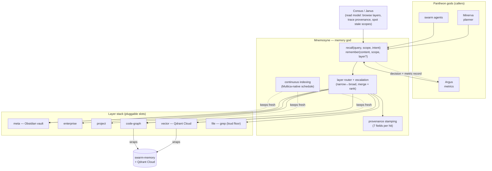

# Mnemosyne

[](https://github.com/mdostal/mnemosyne/actions/workflows/ci.yml)
[](./LICENSE)
[](https://github.com/mdostal/pantheon-v2)
[](https://mdostal.github.io/mnemosyne/)

**The Pantheon's Memory god** — one unified layer that *writes and recalls* across every memory scope the swarm has, so **"memory over find"** becomes the default retrieval path for every agent instead of `grep`/`find`.

Named for the Greek titaness of memory. Site + diagrams: **[mdostal.github.io/mnemosyne](https://mdostal.github.io/mnemosyne/)**.

## What & why

The swarm already runs real memory infrastructure — remote **Qdrant Cloud** vector memory (via [`swarm-memory`](https://github.com/mdostal/swarm-memory)), a code/docs impact graph, and the hive's **Obsidian** knowledge vault (Consus's knowledge home). The problem is that these are **separate, manually wired, and un-unified**: no single service owns the layer stack, no one `recall`/`remember` API spans them, and so agents fall back to `find`/`grep` because the memory path isn't the obvious one.

Mnemosyne exists as its own god so that **one service owns the memory contract** for the whole Pantheon. It **unifies infrastructure we already run** behind a single, escalating, provenance-tracked API — it does **not** reinvent the vector DB, the embedder, or the vault. Every other god calls Mnemosyne to remember and recall; Mnemosyne routes writes to the right layer and walks the stack on reads.

## The layer stack

Memory is organized as an ordered, escalating stack — meta (broad) to file (raw). A recall walks the layers and merges/ranks hits **with provenance**; a write routes to the correct layer(s) and keeps indexes coherent.

```
meta        (hive Obsidian vault — Consus knowledge home / canonical truth)
  → enterprise   (org-wide knowledge + standards, promoted from approved CBAs)
    → project    (per-project working memory, decisions, context)
      → code-graph   (typed impact graph: depends_on / cites / implements)
        → vector     (Qdrant Cloud — default backend, semantic recall)
          → file     (raw grep — loud-failure floor)
```

Backends are **pluggable**: Qdrant is the *default* vector backend but the slot is swappable (any OpenAI-compatible embeddings / alternate vector store); Obsidian is the default meta store but the meta layer is a contract, not a hard dependency. Slot config is owned by **Vesta**.

## Architecture



Mnemosyne fills the **memory capability slot** in Pantheon: one god per capability, ABI-swappable, owns its own memory, runs standalone, standard interface. It is a **library/service** other gods call — it does not plan, orchestrate, or route work. Every recall/write logs a decision + metric record (to Argus/Metis) like every other god.

## How it fits

- **Host / framework:** [pantheon-v2](https://github.com/mdostal/pantheon-v2) — the core host that assembles gods behind shared contracts.
- **Substrate:** work is planned and executed on [Multica](https://github.com/firefly-events/multica) with the [plugin-hive](https://firefly-events.github.io/plugin-hive/) SDLC (kickoff → plan → execute → review → test → ship). Continuous indexing schedules are **Multica-native** (no localized cron).
- **Sibling gods it talks to:** **Minerva** (planner) and swarm agents are the primary recall callers; **Consus** / **Janus** provide the human read model (browse layers, trace a recall's provenance, spot stale scopes); **Vesta** owns which backend fills each layer slot; **Argus** / **Metis** receive the decision + metric records.
- **Builds on:** [`swarm-memory`](https://github.com/mdostal/swarm-memory) (Qdrant-backed semantic memory + code/docs impact graph) — adopted/wrapped as the vector and code-graph layers, **not** rewritten.

## Quickstart

```bash
gh repo clone mdostal/mnemosyne
cd mnemosyne
npm install
npm test
```

See `npm run` in `package.json` for the service entrypoint, and [`hooks/README.md`](./hooks/README.md) to wire the pre-recall/post-remember hooks into an agent runner.

The underlying vector memory Mnemosyne wraps is **already live** — it runs today through `swarm-memory` against remote Qdrant Cloud (credential at `~/.config/swarm-memory/qdrant.key`; **do not wipe** existing collections or the Obsidian vault — Mnemosyne is additive).

## Status

**Phase 1 v1 is implemented.** The service wraps the existing `swarm-memory`
engine, and `hooks/` contains the runner-agnostic pre-recall/post-remember loop:
small per-repo + shared memory bundles before a ticket, status-aware write-back
after a run, and a cache-safe prompt layout that keeps the stable prefix
separate from the variable ticket memory delta.

## Install hooks

`bin/mnemosyne-install-hooks` auto-wires `hooks/settings.hooks.json` into a
Claude Code `settings.json` — see [`hooks/README.md`](./hooks/README.md#install-the-hooks)
for usage.

## Tests

Run the Minerva-style end-to-end integration test with:

```bash
npm run test:e2e
```

The test imports `MnemosyneClient`, recalls `authentication flow` from the
project scope, verifies vector provenance, forces vector degradation to confirm
file-layer fallback, starts the client HTTP API, and checks that `POST /recall`
matches the library result. It uses a temporary fake `swarm-memory` executable,
so it does not require live Qdrant access.

## Read next

- **[`docs/architecture.md`](./docs/architecture.md)** — component + request-flow diagrams, the layer
  stack, and the two running services.
- **[`docs/vision.md`](./docs/vision.md)** — current state, near-term goals, and the long-term
  pluggable-backend / A-B-tested / metrics-driven vision.
- **[`idea-brief.md`](./idea-brief.md)** — the full brief: the layer stack, the unified recall/write
  API, memory-over-find, continuous indexing, viewable in Consus/Janus, pluggable backends, and how
  it builds on the existing Qdrant + Obsidian setup.
- **[`hooks/README.md`](./hooks/README.md)** — the v1 hook contract, prompt-cache layout, runner-neutral
  bundle shape, env knobs, and proof commands.
- `hive.config.yaml` — Hive workflow config for headless planning.

## Support

Mnemosyne is free and open source (MIT). If it saves your swarm tokens,
consider [sponsoring the work](https://github.com/sponsors/mdostal) or
contributing — see **[CONTRIBUTING.md](./CONTRIBUTING.md)**.
