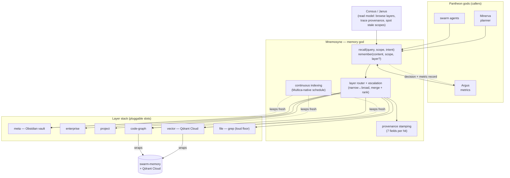
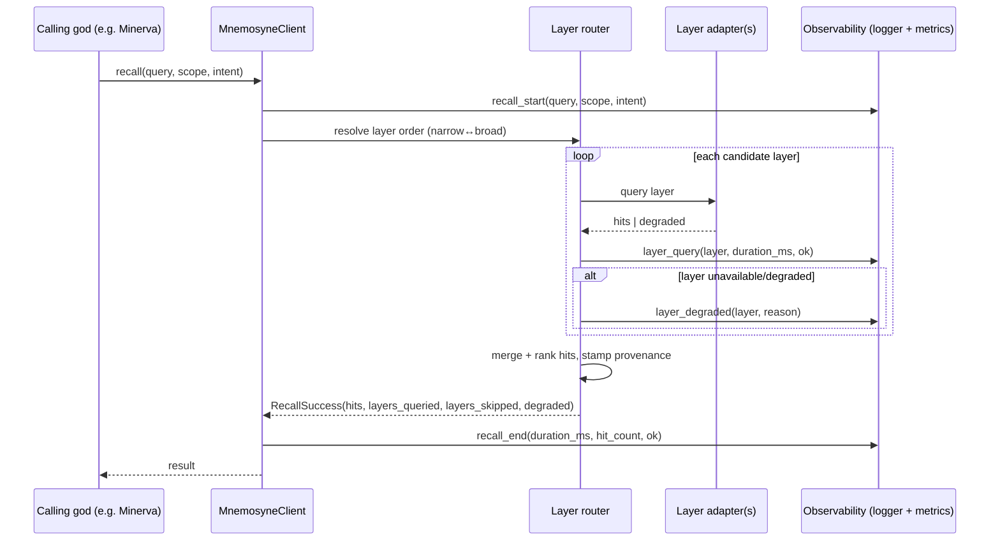

# Architecture

Mnemosyne is a **library/service** other Pantheon gods call to `recall()` and
`remember()` — it does not plan, orchestrate, or route work itself. It fills
the memory capability slot in Pantheon: one god per capability, ABI-swappable,
owns its own memory, runs standalone, standard interface.

## The layer stack

Memory is organized as an ordered, escalating stack — meta (broad) to file
(raw). A recall walks the layers and merges/ranks hits **with provenance**; a
write routes to the correct layer(s) and keeps indexes coherent.

```
meta        (hive Obsidian vault — Consus knowledge home / canonical truth)
  → enterprise   (org-wide knowledge + standards, promoted from approved CBAs)
    → project    (per-project working memory, decisions, context)
      → code-graph   (typed impact graph: depends_on / cites / implements)
        → vector     (Qdrant Cloud — default backend, semantic recall)
          → file     (raw grep — loud-failure floor)
```

Backends are **pluggable**: Qdrant is the *default* vector backend but the
slot is swappable (any OpenAI-compatible embeddings / alternate vector
store); Obsidian is the default meta store but the meta layer is a contract,
not a hard dependency. Slot config is owned by **Vesta** — see
[`docs/vision.md`](./vision.md) for how the A/B/metrics story plays out here.

## Component diagram



## Request flow — a `recall()` call



Every hit carries the mandatory 7-field provenance record (`layer`, `source`,
`chunk_span`, `index_timestamp`, `content_hash`, `embedder`,
`retrieval_time`); a layer that cannot supply a field returns it explicitly
as `null`, never omits it. A degraded or unreachable layer is flagged in the
response — recall never silently falls back without saying so (the **loud
failure** contract in `.pHive/cross-cutting-concerns.yaml`).

## Two services, two ports

Mnemosyne currently runs as two separate processes:

| Service | Entry point | Port | Wraps |
|---|---|---|---|
| Production recall/remember service | `src/server.mjs` | `:8477` | `swarm-memory` engine over remote Qdrant Cloud |
| `MnemosyneClient` HTTP API | `lib/mnemosyne/server.ts` | `:3141` | `MnemosyneClient` (code-graph/vector/file routing) |

See [`docs/http-api.md`](./http-api.md) for the client-API request/response
contract and [`SERVICE.md`](../SERVICE.md) for the production service.

## How it fits in Pantheon

- **Host / framework:** [pantheon-v2](https://github.com/mdostal/pantheon-v2) — the core host that assembles gods behind shared contracts.
- **Substrate:** work is planned and executed on [Multica](https://github.com/firefly-events/multica) with the [plugin-hive](https://firefly-events.github.io/plugin-hive/) SDLC (kickoff → plan → execute → review → test → ship). Continuous indexing schedules are **Multica-native** (no localized cron).
- **Sibling gods it talks to:** **Minerva** (planner) and swarm agents are the primary recall callers; **Consus** / **Janus** provide the human read model (browse layers, trace a recall's provenance, spot stale scopes); **Vesta** owns which backend fills each layer slot; **Argus** / **Metis** receive the decision + metric records.
- **Builds on:** [`swarm-memory`](https://github.com/mdostal/swarm-memory) (Qdrant-backed semantic memory + code/docs impact graph) — adopted/wrapped as the vector and code-graph layers, **not** rewritten.

## Related docs

- [`docs/http-api.md`](./http-api.md) — the `MnemosyneClient` HTTP API contract
- [`docs/observability.md`](./observability.md) — structured log events + metrics emitted per recall/remember
- [`docs/bespoke-inventory.md`](./bespoke-inventory.md) — bespoke layer inventory
- [`docs/vision.md`](./vision.md) — current state, near-term goals, long-term (pluggable-backend A/B) vision
- [`hooks/README.md`](../hooks/README.md) — the pre-recall/post-remember agent-loop hook contract
